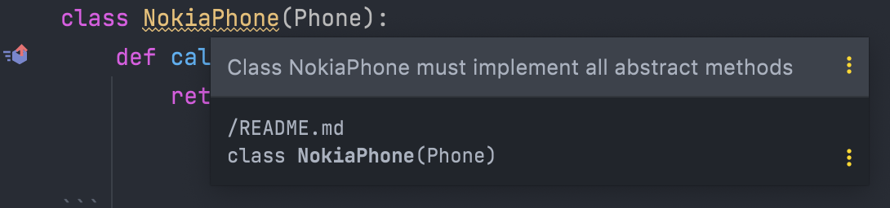

# Interface Segregation Principle
> Many client-specific interfaces are better than one general-purpose interface

## 1 general-purpose interface
Following is an example of a general-purpose `Phone` class. It consists of several methods e.g. `call`, `send_email`, `pay_with_nfc`.

```python
from abc import abstractmethod

class Phone:
    @abstractmethod
    def call(self):
        raise NotImplementedError
    
    @abstractmethod
    def send_email(self):
        raise NotImplementedError

    @abstractmethod
    def pay_with_nfc(self):
        raise NotImplementedError
```

We need to have a class represent a good old Nokia phone. However, it could only make phone calls 🤷🏻‍
```python
class NokiaPhone(Phone):
    def call(self):
        return make_phone_call()
```

It is however impossible to only specify `call` method inside this class, since it inherits `Phone` which also has `send_email` and `pay_with_nfc` method.

So we need to include those 2 methods into `NokiaPhone` class despite it does not have those functionalities.
```python
class NokiaPhone(Phone): 
    def call(self):
        return make_phone_call()

    def send_email(self):
        pass # noop

    def pay_with_nfc(self):
        pass # noop
```

This implementation of `NokiaPhone` class is odd because we still need to specify method that we know for sure its instances will never use.

## Client-specific interfaces
Instead of having 1 general-purpose `Phone` class that might contain methods that certain instances might not need, let's split it into different specific interfaces:

```python
from abc import abstractmethod

class BasicPhone:
    @abstractmethod
    def call(self):
        raise NotImplementedError

class SmartPhone(BasicPhone):
    @abstractmethod
    def send_email(self):
        raise NotImplementedError

class NFCBuiltInPhone(BasicPhone, SmartPhone):
    @abstractmethod
    def pay_with_nfc(self):
        raise NotImplementedError
```

Then we can get used of those interfaces like:
```python
nokia_phone = BasicPhone()
nokia_phone.call()

first_iphone = SmartPhone()
first_iphone.send_email()

latest_iphone = NFCBuiltInPhone()
latest_iphone.pay_with_nfc()
```

# TLDR;
* No clients should be forced to depend on methods it does not use.
* ISP splits large, general-purpose interfaces to more specific ones so that clients will only have to know about the methods that they are interested in. Those shrunken interfaces are called *role* interfaces.
* Role interfaces are decoupled from each other which makes the code base easier to refactor, change and deploy.
